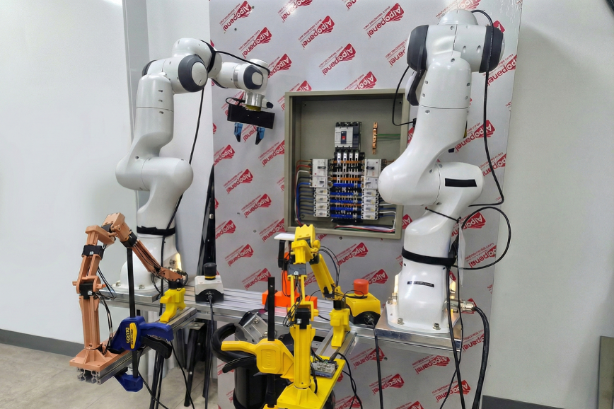

# ⚡ Energy-Expert-Teleop: Bimanual Franka Dataset

> **Note:** This dataset was constructed as part of the research for the paper: **"A Hierarchical LLM-Based Framework for Heterogeneous Multi-Robot Orchestration in High-Risk Energy Facility Maintenance"** (*IEEE Access*, 2026).
**Energy-Expert-Teleop** is a high-fidelity bimanual teleoperation dataset capturing expert demonstrations for safety-critical maintenance tasks in electrical distribution panels.

Collected using a dual-arm system comprising two Franka Emika Panda robots, this dataset is designed to advance research in Imitation Learning (IL) and robotic manipulation for industrial Operation & Maintenance (O&M). It specifically targets long-horizon, high-precision tasks required in energy facilities.

[Download link](https://drive.google.com/drive/folders/1_V1ZfJg48lpO4CfP02YbHN4dPlmcIoRa?usp=drive_link)


<p align="center">
  
  <br/>
  <em>Figure 1. Teleoperated bimanual manipulation in measuring voltage.</em>
</p>

## 📌 Features

* **Bimanual Coordination**: synchronized control data from two 7-DoF Franka Panda arms.
* **High-Precision Manipulation**: Captures fine-grained skills such as open panel door, switch toggling, and voltage measuring.
* **Multi-Modal Data**: Includes synchronized RGB images (multi-view) and proprioceptive states (joint positions, velocities, and etc.).

## 🛠 Hardware Setup

The data was collected using a custom teleoperation setup.
* Follower Robots: 2 $\times$ Franka Emika Panda (7-DoF)
* Leader Robots: 2 $\times$ GELLO (7-DoF)
* Cameras: Wrist-Mounted - DJI Osmo Action 5 Pro on each arm

<p align="center">
  
  <br/>
  <span style="color: #888888;"><em>
    Figure 2. Tele-operation environment setup.
  </em></span>
</p>

## 🤖 Tasks

The dataset consists of 3 core maintenance tasks essential for energy facility management.

1. Panel Door Opening
2. Measuring voltage with probes
3. Toggle switch to turn off (single-arm)

## 📂 Data Structure

The dataset follows the standard HDF5 format, compatible with ACT, Aloha, and Diffusion Policy codebases.

```text
data/
├── panda_open_door/
│   ├── episode_0.hdf5
│   ├── episode_1.hdf5
│   └── ...
├── panda_switch_off/
│   └── ...
└── panda_voltage_check/
    └── ...
```

## 📂 HDF5 Data Structure

The dataset consists of HDF5 files (`episode_x.hdf5`), each containing the following structure:

```text
episode_x
├── action                (T, 14)          # Target joint positions (7-DoF x 2)
└── observation
    ├── images
    │   ├── wrist_1       (T, 480, 640, 3) # RGB from wrist 1 cam
    │   └── wrist_2       (T, 480, 640, 3) # RGB from wrist 2 cam
    ├── qpos              (T, 14)          # Current joint positions
    └── qvel              (T, 14)          # Current joint velocities
```

## 📑 Citation

If you find our paper or dataset useful for your research, please consider citing our work:

**BibTeX:**
```bibtex
@ARTICLE{lee2026energy,
  author={Lee, Jungi and Kim, Seu-Jan and Lee, Geonhyup and Kim, Kangmin and Jeon, Jimin and Ko, Seok-Kap and Lee, Kyoobin},
  journal={IEEE Access}, 
  title={A Hierarchical LLM-Based Framework for Heterogeneous Multi-Robot Orchestration in High-Risk Energy Facility Maintenance}, 
  year={2026},
  volume={14},
  number={},
  pages={66881-66898},
  doi={10.1109/ACCESS.2026.3684055}
}
```

## 📧 Contact

For technical questions or data access issues, please contact:

* Maintainer: Jungi Lee (jungi@etri.re.kr)
* Affiliation: GIST AI Lab
